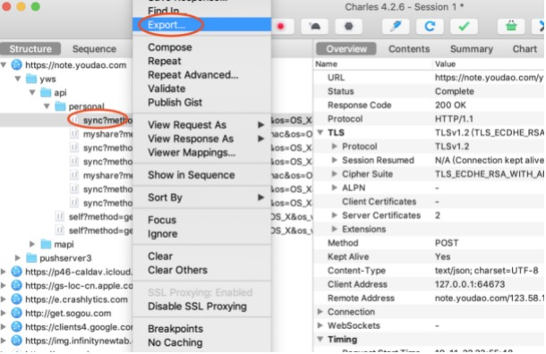
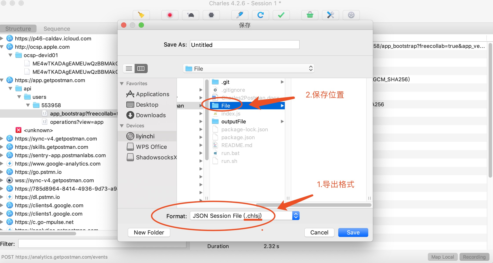
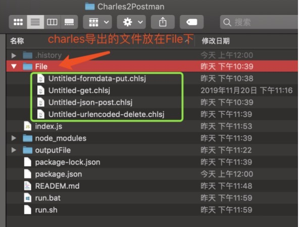
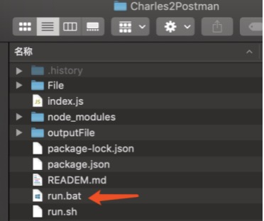
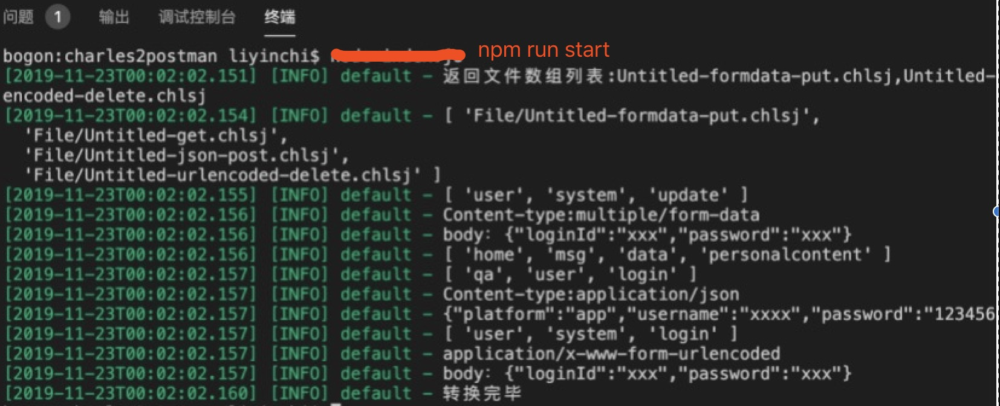
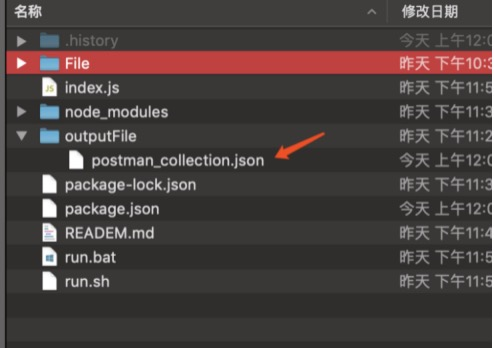
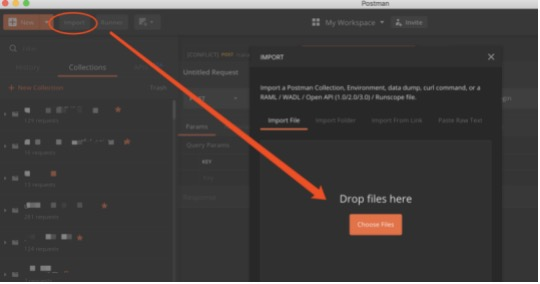
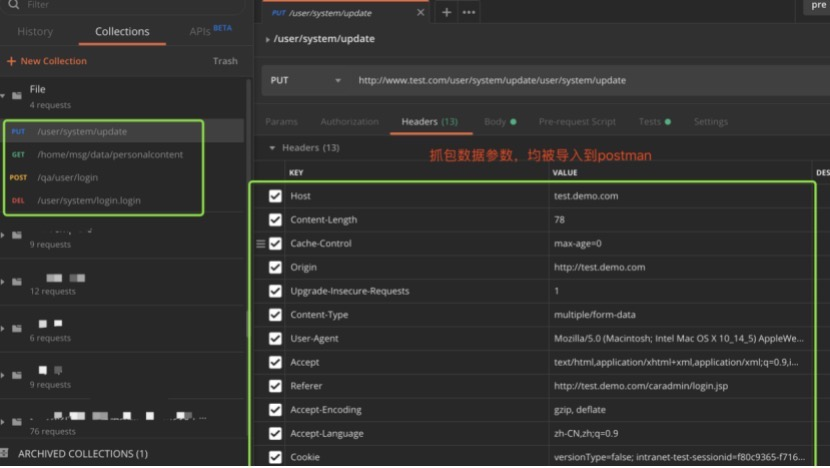

# Charles2Postman

[](https://nodejs.org/en/blog/release/v8.11.4/) [](https://www.postman.com/downloads/)[](https://www.charlesproxy.com/download/latest-release/)

recommend: [China-Gitee](https://gitee.com/liyinchi/Charles2Postman)，[Other-Github](https://github.com/liyinchigithub/Charles2Postman)


功能说明
===
```
测试小伙伴，经常使用Charles抓取数据包，但要将数据包内容复制到postman这是是一件费时费力的事情。

Charles2Postman可以帮助你，批量将Charles导出的抓包请求响应数据文件，快速转成支持导入postman格式，

让你在没有restful API设计文档情况下，快速构建postman客户端请求脚本，无需再一个个参数复制粘贴，节省时间。

```
支持基于http、https协议请求，请求数据类型支持urlencoded、json、form-data、html

版本
===

```
charles 版本 4.2.6

postman 版本 7.12.0

node 版本 大于v8.11.4
```


感谢[guohao0328](https://github.com/guohao0328)提出的第一个bug

环境
===

下载并安装nodejs
```
https://nodejs.org/en/
```

使用
===

进入目录

```

# 打开终端窗口，切换目录到项目下，执行下面这条命令
cd charles2postman
```
安装依赖
```
# 打开终端窗口，依次执行下面两条命令
npm config set registry http://registry.npm.taobao.org/
npm install
```

使用charles抓包工具
---


#### 将抓包内容，从Charles中导出

* 例如，导出某个域名下的所有接口


>1.4.0版本后支持多接口单次导出，即可解析所有charles数据接口


#### 将抓包内容，从Charles中导出单个接口



#### 选择导出格式为".chlsj"

>注意：导出请求格式为 JSON Session File（.chlsj），保存至Charles2Postman目录下File文件夹中。




#### 将导出文件，保存至File文件夹中



>注意：File文件下面，不要放入其他格式的文件，仅能存放charles导出.chlsj格式文件，否则解析会出错。

开始转换
---

#### 方式一：
双击run.bat文件



#### 方式二：

```
npm run start

```


或

```
sudo sh run.sh
```


输出文件
---

转换结果，生成在outputFile目录下

```
./outputFile/postman_collection.json
```


将转换结果，导入postman
---

将这个postman_collection.json导入postman中




最终效果
---



>对你有所帮助的话，记得start下项目，谢谢你的支持
